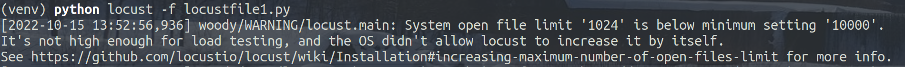
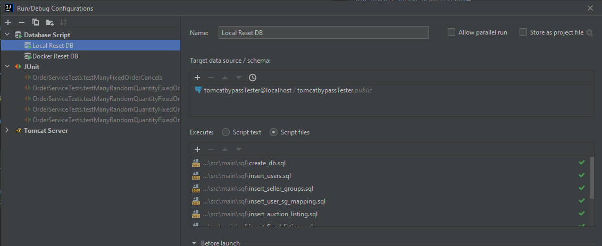

# tomcatbypass

Deployed at: [tomcatbypass](https://tomcatbypass.herokuapp.com/)

## Latest Release

[SWEN90007_2022_part_4_team2](https://github.com/SWEN900072022/tomcatbypass/releases/tag/SWEN90007_2022_part_4_team2)

## What Does it Do?

This is a web app for a Marketplace System which aggregates listings from sellers, so that buyers can purchase those listings through auctions or normal sales.

## What is the technology stack?

The backend uses Java 11.

The frontend may use servlets as a control layer and JSPs for a view layer

## Configuration and Setup For Local Development

### Installs

Download and install [Apache Tomcat 9](https://tomcat.apache.org/download-90.cgi)

Download and set up a [PostgreSQL](https://www.postgresql.org/) instance

### Database

Inside the source code there is an SQL folder. This folder has scripts for setting up your postgres database. Run the following files in this order (or make a script to do it for you)

```BASH
create_db.sql
insert_user.sql
insert_seller_groups.sql
insert_user_sg_mapping.sql
insert_auction_listing.sql
insert_fixed_listing.sql
insert_bid.sql
insert_auction_order.sql
insert_fixed_order.sql
```

This will set up some data for you in the database including an admin user.

### Login Credentials

#### Admin User Details
- Username: `Admin`
- Password: `password`
- I know it's bad! You change the password you're the admin now ;)

#### User Details
- Username: `AppUser`
- Password: `password`
- Is in a seller group already and has several listings

#### User Details
- Username: `Jimmy`
- Password: `password`
- Not in a seller group
- Has a few orders but no listings

#### User Details
- Username: `Gus F`
- Password: `password`
- Same as Jimmy, but has a few bids

### Environment

Ensure you set your environment variables, you require the following:

- `POSTGRES_URL`: This should be your postgres url, ensure you include jdbc: at the beginning and do not include the username or password in this URL
- `POSTGRES_USER`: This should be your admin posgres username
- `POSTGRES_PASSWORD`: This should be the password to your postgres instance

After that, there are two options:

1. Configure Intellij to run a Java Enterprise project and tell it where Tomcat is installed. This works on all platforms.
2. If on UNIX you can use [this script](linux_dev.sh) and just run `./linux_dev.sh` to refresh the server with changes to your code.

## Load Testing

We have decided to load test our application using a tool called [locust](https://locust.io/).

This tool allows us to write our test scenarios programmatically, which is indispensable for complex scenarios like setting up a 'bidding war' between multiple users.

The easiest way to run it is with Docker:

```Bash
# Navigate to tomcatbypass directory
cd tomcatbypass

# Build any images we need
docker compose build

# Build the .war file and start a bunch of containers
mvn clean package -Dmaven.test.skip -DskipTests && docker compose up --scale worker=4
```

The above command will start containers with the following:

- A tomcat server with our app deployed on port `8080`
- A locust master node at http://0.0.0.0:8089/ with 4 worker nodes
- A postgres db on port 5444 with these details:
  - Password: `123`
  - Username: `postgres`
  - Port: `5444`
  - Database Name: `sda`

### Setup

Follow these steps if you don't want to use Docker.

All load testing files are written in Python and stored in the [python](src/test/python) directory inside `src/test`.

```Bash
# Navigate to testing directory
cd src/test/python

# Create a virtualenv
virtualenv venv

# Activate the virtualenv
source venv/bin/activate

# Install locust into the virtualenv
pip install locust beautifulsoup4

# Try running a single test
locust -f locustfiles/locustfile1.py
```

If after running the first test you see a log as below mentioning "System open file limit" then try to fix it using the instructions [here](https://github.com/locustio/locust/wiki/Installation#increasing-maximum-number-of-open-files-limit)



The solution on linux is simple, just increase the limit for your terminal session

```Bash
# Check the current hard limit
ulimit -Hn

# Set the limit to the value you got from the above command
ulimit -n <value_from_above>
 ```

Now you can run load tests.

```Bash
# To run a single node
locust
```

Analysis of the results of these tests can be found in the report, however you are welcome to run them yourself.

## JUnit Testing
Within the [src/test/java](src/test/java) directory we have a set of Java JUnit tests for concurrency. These are grouped by the services they intend to test.
Some of these tests have assertions others just have comments informing you of what to expect.

If you would like to run the tests ensure you ALWAYS reset the database before each test is run otherwise we cannot be sure that the assertions will pass

We recommend that you set up a configuration to reset the database easily similar to what is shown below. The correct order is referenced above in this very same file.



## Where did the name come from?

Our app is so much more than Tomcat, you could say it bypasses it.

## I need more info

Check out the [Docs](docs)

## Team Members

| Name                | Student ID |
|---------------------|------------|
| James Hollingsworth | 915178     |
| James Vinnicombe    | 916250     |
| Sable Wang-Wills    | 832251     |
| Thomas Woodruff     | 834481     |
